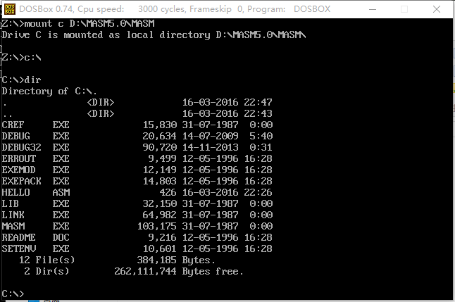
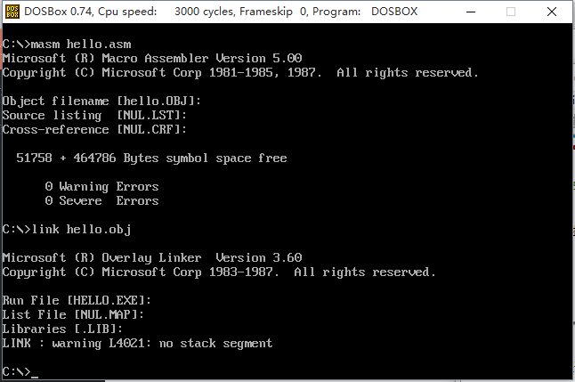
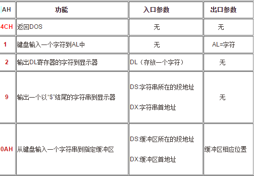

#汇编语言输出hello world
##环境描述
* 系统 win10x64
> 使用工具为dosbox0.74

* 编译器 MASM5.0

##运行方法
对于dosbox，首先需要挂载c盘

使用命令

```
mount c D:\MASM5.0\MASM
```

之后切换到挂载的c盘

```
c:\
```

>这里事先在windows文本编辑器下写好的会汇编语言储存为xxx.asm放在目录下比较方便

使用dir命令查看是否进入到了期望的目录



之后就可以正式开始进行编译工作了

使用
```
masm hello.asm
link hello.obj
```

中途跳出来的东西根据谷歌直接回车

于是编译出来了hello.exe



直接执行后，就可以看到输出的hello world了


##源码及注释

  		data segment             定义一个数据段
		tab db 'hello world$'    这里用内存存放字节数据 'hellow world'$用来判断字符串是否输出完毕（1）
		data ends                数据段结束

		code segment             定义一个代码段
		assume cs:code, ds:data  这里把程序中定义的段与对应的段寄存器关联起来
		start:                   程序开始
        mov ax,data			     把数据赋给寄存器ax（起一个过渡作用）（2）
        mov ds,ax                这里把数据段的地址放到数据段寄存器ds中
        lea dx,tab               把要输出的字符串名让dx储存
        mov ah,9h			     （3）
        int 21h                  调用21号中断的9号功能来显示字符串
        mov ah,4ch				 参照（3），返回dos
        int 21h   				 程序返回
 		code  ends               代码段结束
        end start                从start开始执行


>以下内容来自谷（bai）歌（du）
>
>（1）'$'是DOS功能调用INT 21H中9号功能要求的要显示字符串的结束标志，同时那一段定义字符串也可以写成'hello world'24h; 因为24h就是'$'
>
>（2）无法把数据直接从内存移到DS，只能从寄存器移到DS，所以需要先把数据移到AX寄存器，然后再移到Ds寄存器。
>
>（3）
>
>

