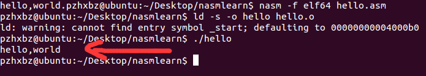

#linux下用nasm编译运行hello—world

##准备工作
###环境
* 运行系统ubuntu14.04（vmware12）
* nasm版本 2.12

###安装nasm
* 首先从官网下载nasm-2.12.tar.gz
* 解压缩
* cd进解压的目录
* 构建.安装文件

	
		./configure

		make

		(sudo) make install

>值得一提的是，现在大多数linux自带nasm的软件包，可以使用
>
>		$ sudo apt-get install nasm
>		
>	进行安装（智障了）

* 安装完成后，就可以开始进行编译工作了

##编译与运行

首先

		vi hello.asm

创建源代码文件

然后使用nasm进行编译

		nasm -f elf64(因为使用的是64位的系统) hello.asm

然后就会生成hello.o这个文件

接下来进行链接

使用

		ld -s -o hello hello.o

>两个参数的意思查帮助手册可以获得
>
>-o Use output as the name for the program produced by ld; if this option is not specified, the name a.out is used by default. 

>-s Omit all symbol information from the output file. 

之后就生成了hello这个可执行文件

直接

		./hello

就可以看到

撒花撒花~~~

##源码及注释
	global _start 				    //这东西类似于main（）函数？（谷歌）

	section .data 					//数据段声明
	message db "hello,world",0xA    //定义要输出的字符串，
    len equ $ -message				//字符串长度
	section .text                   //代码段声明

	_strat:
	mov eax, 4                      //调用sys_write（1）
	mov ebx, 1                      //文件描述符（）
	mov ecx, message                //把要输出的字符送入ecx
	mov edx, len					//字符串长度
	int 80h                         //类似于int 21h（谷歌），调用系统功能,在64位下好像使用syscall也可以

	mov eax, 1                      //调用sys_exit
	mov ebx, 0                      //参数，（感觉有点像c语言里的exit();）
	int 80h

>（1）sys_write(unsigned int fd, const char * buf, size_t count)
>fd是文件描述符
>
>buf显然是缓冲区，存放写入或者读出的数据
>
>count对应的是字节数

ps：

linux的系统调用和dos的调用好像有一定的区别：

1. 放系统调用号到eax中 

2. 设置系统调用参数到ebx,ecx等 

3. 调用相关中断(DOS:21h;	linux:80h) 

4. 返回结果通常保存在eax中 

（百度）